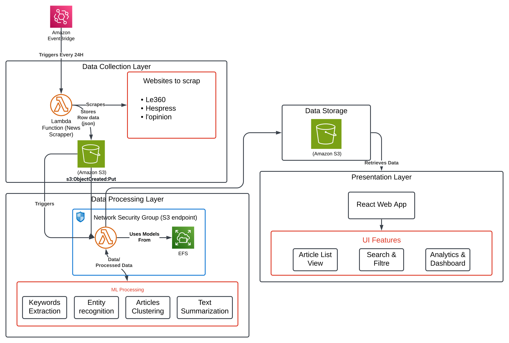
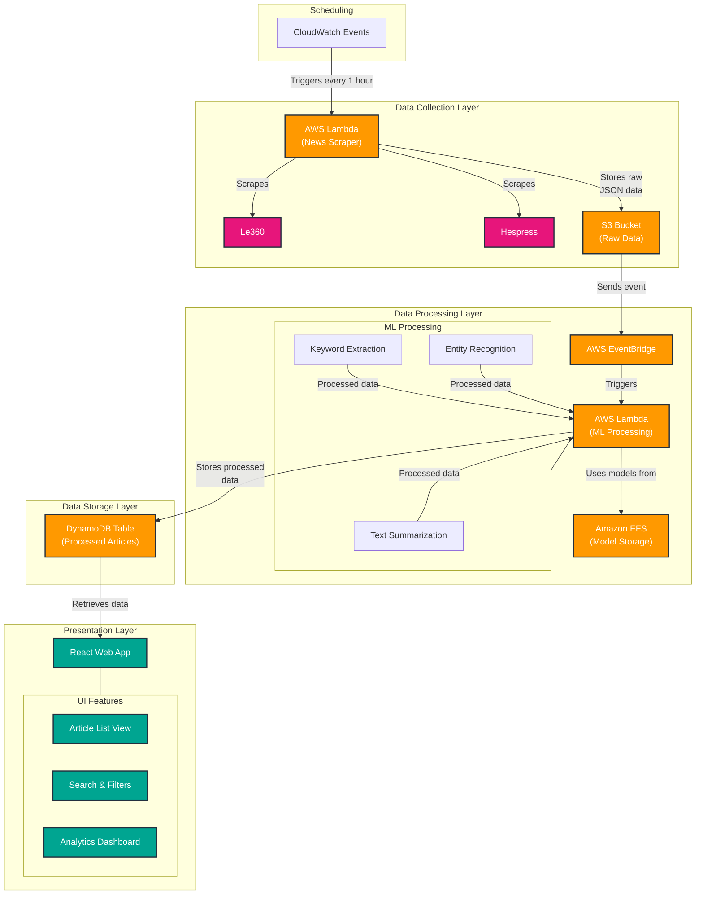

# Khbar f'deqqa (News at Once)

## Overview

**Khbar f'deqqa** is a fully automated news aggregation and summarization system designed to collect, process, and present news from major Moroccan news sources in an easily digestible format. The system is built to streamline the consumption of news by providing concise summaries and key insights, making it easier for users to stay informed.

## Workflow

The system operates through a series of interconnected components, each playing a crucial role in the news aggregation and summarization process. Below is a visual representation of the workflow:

### Mermaid Flowchart

## Components

### Scheduling
- **CloudWatch Events (CE)**: Triggers the news scraping process every hour.

### Data Collection Layer
- **AWS Lambda (News Scraper)**: Responsible for scraping news articles from various sources.
- **News Sources**:
  - **Le360**
  - **Hespress**
- **S3 Bucket (Raw Data)**: Stores the raw JSON data collected from the news sources.

### Data Processing Layer
- **AWS EventBridge**: Receives events from the S3 bucket and triggers the ML processing Lambda function.
- **AWS Lambda (ML Processing)**: Handles the machine learning tasks such as text summarization, keyword extraction, and entity recognition.
- **Amazon EFS (Model Storage)**: Stores the machine learning models used for processing.
- **ML Processing Tasks**:
  - **Text Summarization**
  - **Keyword Extraction**
  - **Entity Recognition**

### Data Storage Layer
- **DynamoDB Table (Processed Articles)**: Stores the processed news articles.

### Presentation Layer
- **React Web App**: Provides a user-friendly interface for accessing the processed news articles.
- **UI Features**:
  - **Article List View**: Displays a list of summarized articles.
  - **Search & Filters**: Allows users to search and filter articles based on various criteria.
  - **Analytics Dashboard**: Provides insights and analytics on the collected news data.

## Getting Started

To get started with **Khbar f'deqqa**, follow these steps:

1. **Clone the Repository**: Clone the project repository to your local machine.
2. **Set Up AWS Services**: Ensure you have the necessary AWS services set up, including Lambda, S3, DynamoDB, and EFS.
3. **Deploy the Lambda Functions**: Deploy the Lambda functions for scraping and ML processing.
4. **Configure CloudWatch Events**: Set up CloudWatch Events to trigger the scraping process every hour.
5. **Deploy the React App**: Deploy the React web app to serve the frontend.

## Contributing

We welcome contributions to **Khbar f'deqqa**! If you'd like to contribute, please follow these steps:

1. Fork the repository.
2. Create a new branch for your feature or bugfix.
3. Make your changes and commit them with clear commit messages.
4. Push your changes to your fork.
5. Submit a pull request to the main repository.

## License

This project is licensed under the MIT License. See the [LICENSE](LICENSE) file for more details.

## Contact

For any questions or feedback, please contact [Your Name] at [Your Email].

---

Thank you for using **Khbar f'deqqa**! We hope it helps you stay informed with the latest news from Morocco.
